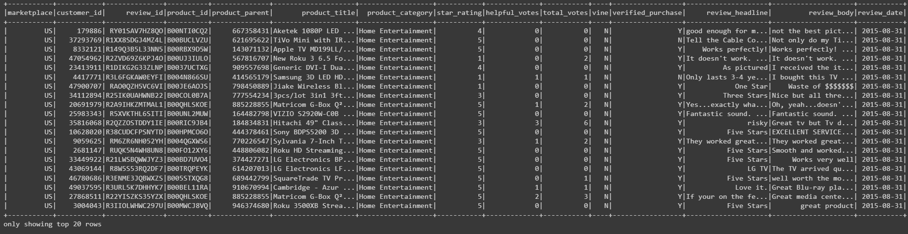
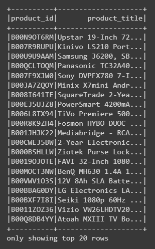
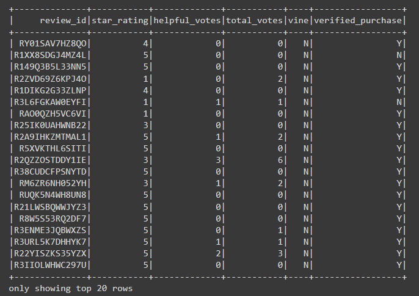
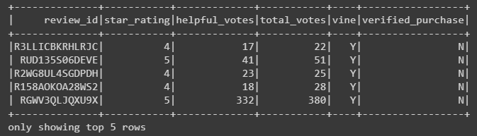
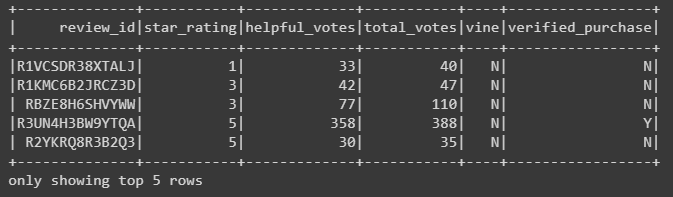

# Marketing Analysis with Big Data

    

## 
Perform Market Analysis with AWS, Spark and SQL

<a href="#goals">Goals</a> &nbsp;&bull;&nbsp;
<a href="#dataset">Dataset</a> &nbsp;&bull;&nbsp;
<a href="#tools-used">Tools Used</a> &nbsp;&bull;&nbsp;
<a href="#analysis-and-challenges">Analysis and Challenges</a> &nbsp;&bull;&nbsp;
<a href="#results">Results</a> &nbsp;&bull;&nbsp;
<a href="#summary">Summary</a>

# 
Goals

Companies pay a small fee to Amazon and provide products to Amazon Vine members, who are then required to publish a review. This project will analyze Amazon reviews written by members of the paid Amazon Vine program. The Amazon Vine program is a service that allows manufacturers and publishers to receive reviews for their products. In this project, you’ll have access to approximately 50 datasets. Each one contains reviews of a specific product, from clothing apparel to wireless products. 

This scope will cover the TV review dataset. First I'll use PySpark to perform the ETL process to extract the dataset, transform the data, connect to an AWS RDS instance, and load the transformed data into pgAdmin. Next, I'll use PySpark to determine if there is any bias toward favorable reviews from Vine members in your dataset.

# 
Dataset

Amazon S3 bucket containing 50 review datasets.

- [Amazon Review Datasets:](https://s3.amazonaws.com/amazon-reviews-pds/tsv/index.txt)  I'll be analyzing a TSV file with 22,930 rows of TV reviews

# 
Tools Used

- **Apache Spark:** A unified analytics engine for large-scale data processing
- **Google Colab:** Cloud based developer notebooks, used for testing scripts and performing complex calculations
- **Amazon Web Services:** Cloud based services that performs many functions, hosting, data processing
    - **AWS RDS:** Relational Database service used for querying data in the cloud
    - **AWS S3:** Cloud file storage service
- **PGAdmin:** Software used to build databases and analyze data with SQL

# 
Analysis and Challenges

After the success of the SellBy project, our group will be running an analysis Amazon reviews written by members of the paid Amazon Vine program. I analyzed the TV review dataset and use PySpark to perform the ETL process to extract the dataset, transform the data, connect to an AWS RDS instance, and load the transformed data into pgAdmin. I then used PySpark to determine if there is any bias toward favorable reviews from Vine members in your dataset.

Below you will see dataframes I used to analyze the TV review data.

### Review Data

### Review ID Table

### Customer Table

### Product Table

### Vine Table

# 
Results

### Unpaid Reviews

- In Total there were 255 Vine reviews and 22,675 unpaid reviews
- Of the 255 Vine reviews, 103 were 5 star reviews (40%)
- Of the 22,675 unpaid reviews, 10,310 were 5 star reviews (45%)

# 
Summary

Based on the results of my analysis comparing Vine and unpaid reviews, I did not see evidence of positivity bias within the paid reviews. A higher percentage of unpaid reviews were 5 stars. 

Here are some additional levels of analyis I am planning to apply to the current data set:
- Compare the number of 1 star reviews between Vine and Unpaid to determine any additional patterns
- Filter the Vine and Unpaid review datasets by verified purchase to add credibility to our review sample analysis

[Back to top](#marketing-analysis-with-big-data)
